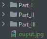

# Parallel Median Filter USER INSTRUCTIONS
TEAM03 | Damien Vermaas & Wyomi Beuker | 02-04-2021

This project contains three implementation of the median filter. Documentation and benchmarking results can be found
under the directory documentation

## Part I - Sequential

Open the source code for the sequential median filter in the part I folder of the project. Navigate to the source code
to find the Sequential_MedianFilter class and follow the following steps:

### Step 1
In the sequential version of the median filter the user can change the images that needs to be filtered by changing the
following line of code (Line 26 in the MedianFilter class)
```java
BufferedImage img = ImageIO.read(MedianFilter.class.getResource("/resources/images/image1.jpg"));
```
The end of image url can be changed to either image1.jpg, image2.jpg, image3.jpg, image4.jpg or image5.jpg.
More information about these images can be found in the teams document.

### Step 2
After everything is changed to the desired settings just simply run the main methode and wait for the output image to
be places in the project main folder.



## Part II - Parallel

Open the source code for the parallel median filter in the part II folder of the project. Navigate to the source code
to find the MedianFilter class and follow the following steps:

### Step 1
In the parallel version of the median filter the user can change the images that needs to be filtered by changing the 
following line of code (Line 36 in the MedianFilter class)
```java
BufferedImage img = ImageIO.read(MedianFilter.class.getResource("resources/images/image5.jpg"));
```
The end of image url can be changed to either image1.jpg, image2.jpg, image3.jpg, image4.jpg or image5.jpg.
More information about these images can be found in the team document.

### Step 2
To change the amount of threads first change the amount of rows and columns needed for splitting the image, 
accoring to the amount of threads needed: (Line 17-18 in the MedianFilter class)
```java

    // Two threads use 1 row 2 columns
    // Four threads use 2 row 2 columns
    // Eight threads use 2 row 4 columns
    private static final int  ROWS = 1;
    private static final int COLUMNS = 2;
 ```
Then comment or un comment the amount of threads needed. For example two thread: (Line 147-175 in the MedianFilter class)
```java
        Thread thread1 = new Thread(() -> {
            BufferedImage filteredImage = sequentialMedianFilter(imageItem[0]);
            MedianFilter._imageModel.setImages(index++, filteredImage);
        });

        Thread thread2 = new Thread(() -> {
            BufferedImage filteredImage = sequentialMedianFilter(imageItem[1]);
            MedianFilter._imageModel.setImages(index++, filteredImage);
        });

//        Thread thread3 = new Thread(() -> {
//            BufferedImage filteredImage = sequentialMedianFilter(imageItem[2]);
//            MedianFilter._imageModel.setImages(index++, filteredImage);
//        });
//
//        Thread thread4 = new Thread(() -> {
//            BufferedImage filteredImage = sequentialMedianFilter(imageItem[3]);
//            MedianFilter._imageModel.setImages(index++, filteredImage);
//        });
 ```
Also do this with the starting and joining of threads. Like this: (Line 177-197 in the MedianFilter class)
```java
        thread1.start();
        thread2.start();
//        thread3.start();
//        thread4.start();
 ```
### Step 3
After everything is changed to the desired settings just simply run the main methode and wait for the output image to 
be places in the project main folder.


## Part III - RMI

Open the source code for the RMI version of median filter in the part III folder of the project. Navigate to the source 
code to find the MedianFilter class and follow the following steps:
### Step 1
The first step the user needs to do to make the RMI approach of the median filter work properly is deciding what image
he/she wants to use to go through the median filter. This can be done by uncommenting one of the five URL's described in
the RemoteService.java class.

```java
    public byte[] extractBytes() throws IOException {
//        URL url = new URL("https://www.upload.ee/image/13017220/image1.jpg");
//        URL url = new URL("https://www.upload.ee/image/13017224/image2.jpg");
//        URL url = new URL("https://www.upload.ee/image/13015441/image3.jpg");
//        URL url = new URL("https://www.upload.ee/image/13017225/image4.jpg");
URL url = new URL("https://www.upload.ee/image/13017228/image5.jpg");
BufferedImage img = ImageIO.read(url);

        ByteArrayOutputStream baos=new ByteArrayOutputStream();
        ImageIO.write(img, "jpg", baos );
        byte[] imageInByte=baos.toByteArray();

        return imageInByte;

    }
```

The next step is for the user to start the RemoteService server by running the RemoteService class.

```java
public class RemoteService extends UnicastRemoteObject implements RemoteInterface {
```

### Step 2
With the server now running it is time to go to the client side of things, the MedianFilter.java class.
The user can simply run the class like previously by running the main method of this class

```java
     public static void main(String[] args) throws IOException, InterruptedException, ExecutionException, NotBoundException {
```


It is important to make sure both the RemoteService class AND the MedianFilter.java main are running at
the same time so they can communicate with each other.